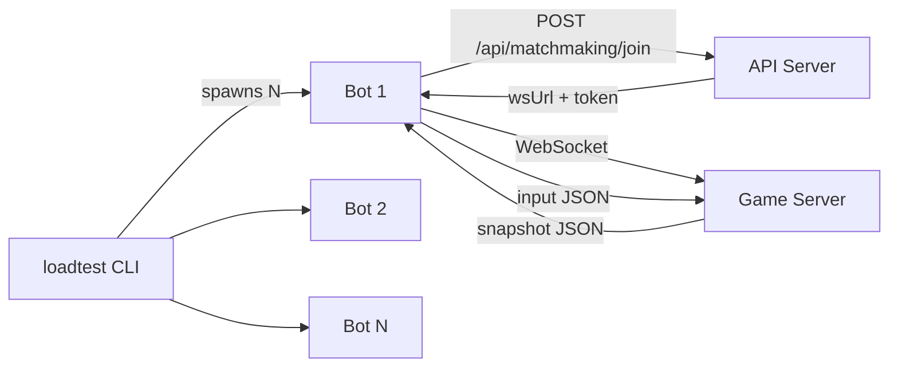

# Intermission Transfer, Graceful Drain, and Load Test Plan

## Goals

- Let players finish their current match during deploy rollouts.
- Move players during intermission with minimal/no perceived downtime.
- Keep deploy-driven transfers in the same gamemode by default.
- Support voluntary intermission transfers to other gamemodes.
- Ensure player intent overrides drain defaults when explicitly requested.

## Current Behavior (Baseline)

- Players normally stay on the same lobby/pod across matches while the websocket stays connected.
- Reassignment to a different lobby happens on reconnect/rematch flows.
- During rollouts, websocket/server shutdown can force reconnect paths that may reassign unexpectedly.

## Target Behavior

- **In-match:** no migration; players complete the match on the current pod.
- **Intermission:** transfer window opens.
- **Deploy drain (default):** transfer to another pod running the same mode.
- **Voluntary transfer:** if a player explicitly picks a different mode, honor that choice.

## Routing Policy and Precedence

1. If a player explicitly requests a mode during intermission, route to that requested mode.
2. Else, if transfer reason is deploy drain, enforce same-mode transfer.
3. Else, use normal intermission defaults (auto-select or user prompt).

In short: explicit player choice wins over drain defaults.

## Handoff Protocol

Introduce explicit handoff semantics so clients do not treat every disconnect as a rematch signal.

- Add a planned websocket close code/reason (example: `4002`, `handoff_required`).
- Include handoff metadata in notice payloads:
  - `intent`: `deploy_drain` | `player_requested`
  - `modeConstraint`: `same_mode` | `any_mode`
  - `currentMode`
  - `allowedModes`
  - `deadlineMs`

### Required behavior

- Client only enters transfer/rematch flow on explicit handoff close reason.
- Generic socket errors should first attempt same-route reconnect, not random reassignment.

## API and Matchmaking Changes

Add/extend a transfer endpoint (recommended):

- `POST /api/matchmaking/transfer`
  - Inputs: player/session context, `intent`, optional `requestedMode`, region.
  - Outputs: fresh ws route token + destination lobby/pod/mode.

Selection logic:

- Filter out draining pods (`state != ready`).
- If `modeConstraint=same_mode`, require destination mode to match `currentMode`.
- If player explicitly requests another mode, prefer `requestedMode`.
- If no capacity exists for requested mode, return explicit unavailability state for UI handling.

## Game Server Drain Behavior

On `SIGTERM`:

1. Mark draining immediately (readiness false and registry state set to draining).
2. Reject new joins.
3. Let active match complete naturally.
4. At intermission, trigger planned handoff flow (not abrupt generic close).
5. Close remaining connections only after handoff timeout window.

## WS Router Shutdown Behavior

- Replace hard shutdown path with graceful drain:
  - stop accepting new upgrades,
  - keep existing proxied sockets alive through grace window,
  - cooperate with planned handoff signaling.

## Kubernetes and Rollout Hardening

- Keep `maxUnavailable: 0` and `maxSurge: 1` for game-server rollout safety.
- Ensure `terminationGracePeriodSeconds` > drain timeout + handoff window + safety margin.
- Add drain-aware readiness behavior so terminating pods are removed from assignment quickly.
- Maintain enough ready capacity per mode to support same-mode drain transfers.

## UX Behavior During Intermission

- Normal intermission: player can remain in mode or choose another mode.
- Drain intermission default: “moving you to another lobby in this mode.”
- If player chooses a different mode during drain intermission, honor that explicit choice.
- If requested mode unavailable:
  - show clear status,
  - allow retry/wait,
  - optionally offer fallback mode choices.

## Observability and Success Metrics

Track:

- `handoff_initiated_total`
- `handoff_completed_total`
- `handoff_failed_total`
- `deploy_drain_same_mode_success_total`
- `player_requested_cross_mode_transfer_total`
- transfer latency percentiles
- mid-match disconnects during rollout

Success criteria:

- No mid-match migrations during deploy.
- High handoff success at intermission.
- Same-mode transfer succeeds by default on deploy drain.
- Explicit cross-mode requests are honored when capacity exists.

## Suggested Implementation Order

1. Define handoff close codes + payload schema.
2. Client reconnect gating (handoff-only transfer triggering).
3. Matchmaking transfer API with mode-aware selection and precedence rules.
4. Game-server drain sequencing updates.
5. WS-router graceful termination updates.
6. Kubernetes timing/capacity tuning.
7. Intermission mode-selection UX and fallback states.
8. Integration/load tests for rolling deploy + multi-mode traffic.

## WebSocket Load-Test Harness Plan

Build a lightweight Node.js load-test harness that connects N headless WebSocket bots and exercises the same matchmaking and in-game input paths used by real clients.

### Harness architecture

Each bot is a self-contained async loop: join via HTTP, connect via WebSocket, receive snapshots, run AI, and send input.

### Planned load-test files

- `loadtest/bot-ai.ts`: TypeScript port of game bot decision logic.
- `loadtest/bot-client.ts`: websocket client lifecycle, snapshot parsing, input loop, reconnect.
- `loadtest/cli.ts`: spawns N bots, collects stats, handles shutdown.
- `loadtest/package.json`: standalone deps (`ws`, `tsx`) and scripts.

### Bot AI scope

Port the server bot behavior for realistic movement/combat pressure:

- nearest-target selection
- collectible scoring/selection
- combat/fire heuristic
- wander retarget timer

Intentional simplifications for snapshot-driven testing:

- skip crash-pair cooldown checks if unavailable in snapshots
- skip invulnerability checks if unavailable in snapshots
- hardcode known health formula/config defaults where needed

### Bot client lifecycle

1. Call `/api/matchmaking/join`.
2. Parse `{ wsUrl, lobbyId, token }`.
3. Connect websocket.
4. On snapshot, compute/send input at capped rate.
5. On close, apply reconnect policy and collect error stats.
6. On CLI stop signal, close all sockets and print summary.

### Stats and reporting

Print periodic summary (for example every 2s):

`[12s] bots: 8/10 connected | snapshots: 242/s | inputs: 160/s | errors: 0`

At exit, print totals: duration, snapshots processed, reconnects, failures.

### How load tests validate this plan

Use harness scenarios to validate:

- rolling deploy with active matches -> no mid-match migration
- intermission deploy drain -> same-mode transfer by default
- explicit player mode-switch during drain -> requested mode honored
- reconnect behavior only follows transfer/handoff close reasons

## Test Matrix

- Active match + pod drain -> match completes -> intermission handoff -> reconnect success.
- Drain with no explicit player choice -> same-mode destination only.
- Drain with explicit cross-mode selection -> requested mode honored.
- Requested mode unavailable -> correct UI/error/retry behavior.
- Generic socket error (non-handoff) -> same-route reconnect first.
- Load-test bots maintain stable connections and expected reconnect semantics during rolling updates.

