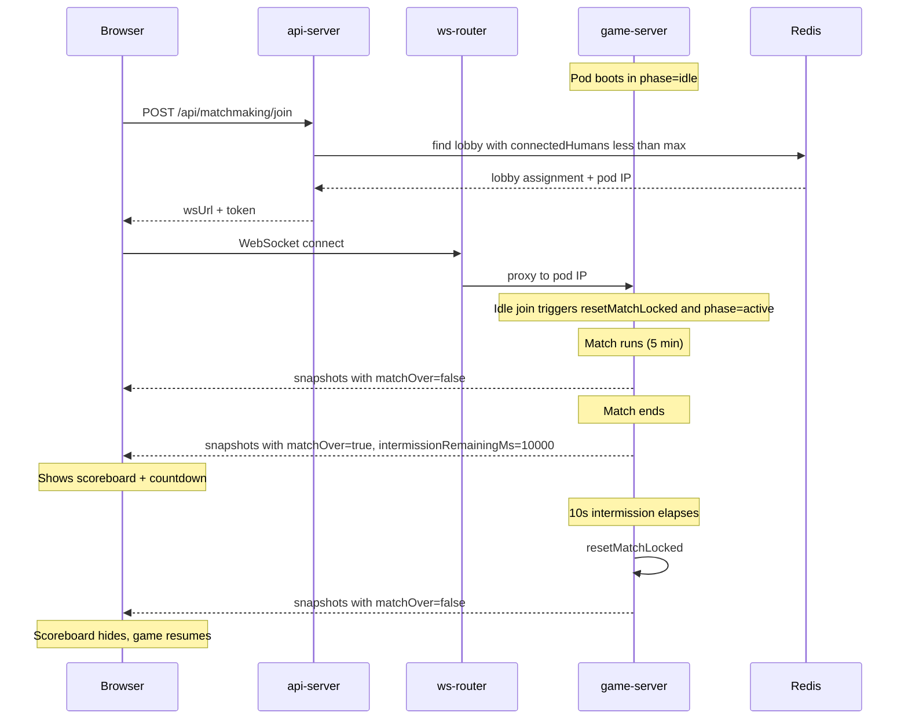
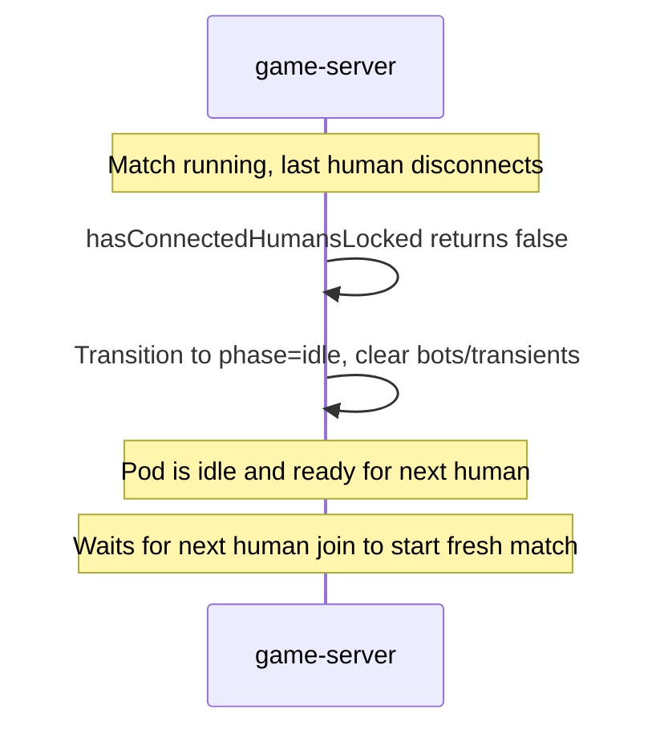
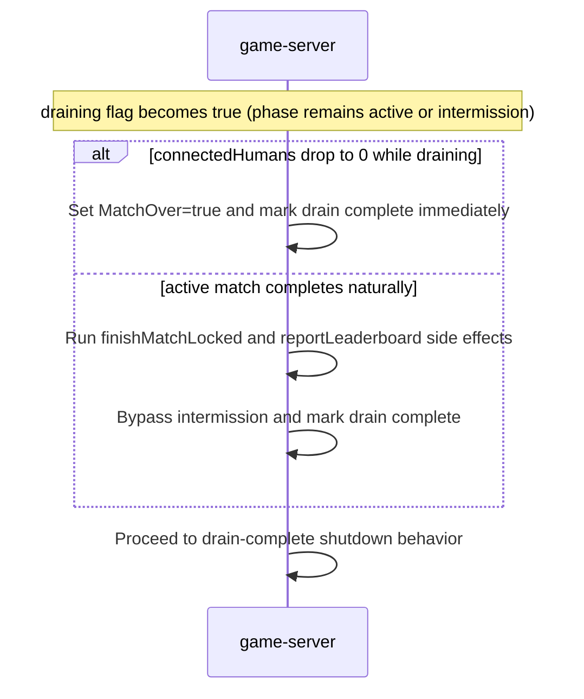

# Match Flow Rework

## 1. Capacity and admission model (connected humans only + hard limit)

Currently, `activeSlotsLocked()` in [`server/internal/game/server.go`](server/internal/game/server.go) counts bots + connected humans, which marks pods as full too early and contributes to 503s. Also, `upsertHumanPlayerLocked` can still insert a new human even if no bot can be removed, which can oversubscribe `MaxPlayers`.

**Changes:**

- Add `connectedHumansLocked()` to count only `!IsBot && Connected`.
- In [`server/internal/game/registry.go`](server/internal/game/registry.go), change `currentRegistryRecord()` to use `connectedHumansLocked()` for `registryStateFull` vs `registryStateReady`.
- In `HandleReadyz` in [`server/internal/game/server.go`](server/internal/game/server.go), use `connectedHumansLocked()` for readiness capacity checks.
- Add a **hard human-capacity rejection** path before admitting a player:
  - If `connectedHumansLocked() >= MaxPlayers`, reject join (HTTP 503 recommended to match temporary capacity semantics).
  - If at effective slot pressure and a bot exists, remove one bot; if no bot exists and humans are already at cap, reject.
- Keep bot-kick behavior as best-effort, but never exceed `MaxPlayers` connected humans.

This ensures matchmaking eligibility and join admission are consistent, and prevents over-capacity races.

## 2. Explicit match phases + orthogonal draining

Add explicit lifecycle state while keeping draining separate from phase:

- Introduce `LobbyPhase` enum in [`server/internal/game/server.go`](server/internal/game/server.go):
  - `idle`
  - `active`
  - `intermission`
- Keep existing `s.draining` as an orthogonal shutdown flag (overlay state), not a phase.
- Keep `IntermissionEnds` for countdown deadline while in `intermission`.

**Phase invariants:**

- `idle`: no active match timer running; no bots required; matchmaking may still route here.
- `active`: simulation is running.
- `intermission`: match ended; leaderboard/countdown shown; gameplay updates paused.

**Orthogonal draining invariants:**

- `draining=true` means: reject new joins, mark registry as draining, and proceed to shutdown flow.
- Valid combined states are:
  - `active + draining` (finish current match simulation, then shut down)
  - `intermission + draining` (cancel intermission immediately, proceed to shutdown)

### `MatchOver` semantics (explicit)

Because client scoreboard currently keys on `matchOver` (not phase), pin semantics explicitly:

- `idle`: `MatchOver=true`
- `active`: `MatchOver=false`
- `intermission`: `MatchOver=true`
- `active + draining`: `MatchOver=false` until match completion
- `intermission + draining`: `MatchOver=true` (no countdown; shutdown path)

## 3. Idle behavior and first-join semantics

### Boot behavior (fix fresh-pod startup race)

Currently `NewServer` initializes a live match timer (`MatchStart/MatchEnds`) and `MatchOver=false`. Plan update:

- Initialize new lobbies in `phase=idle`.
- Keep `MatchOver=true` in idle for UI semantics.
- Do not start a real match until the first human is admitted.

### Last-human disconnect behavior

- If phase is `active` or `intermission` and connected humans drop to 0, transition immediately to `idle`.
- Idle transition should:
  - clear bots,
  - clear projectiles/transient combat state,
  - clear `IntermissionEnds`,
  - avoid starting a new match timer.

### First human join

- In `HandleWS`, if `phase=idle`, call `resetMatchLocked(now)` and transition to `active` before completing join.
- Remove unconditional `if MatchOver { resetMatchLocked(now) }` and replace with phase-aware logic.

## 4. Server-side intermission (10s) and drain policy

Current behavior ends match immediately with no dedicated intermission loop. Updated behavior:

**Intermission logic:**

- On match completion in `active`, transition to `intermission`.
- Set `IntermissionEnds = now + cfg.IntermissionDuration` (default 10s).
- While `intermission`, broadcast scoreboard and `intermissionRemainingMs`.
- When countdown reaches 0 and humans are still connected, call `resetMatchLocked(now)` and transition back to `active`.

**Drain policy (chosen): bypass intermission**

Drain is an overlay (`s.draining`), not a phase. Behavior must be explicit in both entry points:

- If drain begins during `active`:
  - continue normal active simulation (do **not** freeze gameplay),
  - reject new joins,
  - when match completes naturally, preserve normal match-complete side effects (call `finishMatchLocked()`, increment completion metrics, and trigger `reportLeaderboard(...)`),
  - then skip intermission and move straight to drain-complete path.
- If drain begins during `intermission`:
  - cancel intermission immediately (`IntermissionEnds = zero`),
  - do not emit further intermission countdown snapshots,
  - proceed to shutdown flow (clients receive `server_notice`; sockets are then closed by shutdown path).
- If draining and connected humans reach 0 at any point, allow immediate drain completion (no idle/intermission detour).

`WaitForDrain` remains aligned with bypass policy: draining does not wait for intermission.
`WaitForDrain` completion must have two explicit paths:

- natural match completion while draining (`finishMatchLocked` path), or
- forced drain completion when `draining=true && connectedHumans==0`.

### `step()` ordering (phase-aware + drain overlay)

1. If `draining=true && connectedHumans==0`: mark drain complete immediately (`MatchOver=true`) and skip idle/intermission transitions.
2. If connected humans == 0 and not draining: transition to `idle`.
3. If `phase=active`: run simulation regardless of `draining` flag.
4. On active match completion:
   - always run normal completion side effects (`finishMatchLocked`, metrics, `reportLeaderboard`),
   - if `draining=true`: bypass intermission and mark done for drain exit,
   - else: transition to `intermission`.
5. If `phase=intermission` and `draining=false`: run countdown and reset to `active` at expiry.
6. If `phase=idle`: no simulation work.

**Changes to snapshot broadcast:**

- Add `intermissionRemainingMs int64` (`json:"intermissionRemainingMs"`).
- Populate only when `phase=intermission`.
- Keep gameplay frozen during intermission (no simulation ticks applied).

**Config plumbing:**

- Add `INTERMISSION_DURATION: "10s"` to [`k8s/base/game-server/configmap.yaml`](k8s/base/game-server/configmap.yaml) and [`config/game-server.env`](config/game-server.env).
- Add `IntermissionDuration time.Duration` to `Config` struct, loaded via `envDuration` with a default of `10 * time.Second`.
- Add normalization in `normalizeConfig`.

## 5. Disconnected-human handling on idle/reset

Current `resetMatchLocked` retains all non-bot players, which can revive disconnected players. Plan update:

- On idle transition, evict disconnected humans (or mark for exclusion).
- In `resetMatchLocked`, preserve/revive **connected humans only**.
- Ensure disconnected humans are not respawned as inert ships in a fresh match.

## 6. Client-side in-place rematch (stay on /game)

Current `Scoreboard` "Play Again" navigates to `/`, which disconnects.

**Changes to [`client/src/components/Scoreboard.tsx`](client/src/components/Scoreboard.tsx):**

- Add a countdown display (e.g. `Next match in Xs`) driven by `intermissionRemainingMs` from the store.
- Change `Play Again` button to `Leave Match` which navigates to `/`.
- When `matchOver` transitions back to `false` (server auto-reset), the scoreboard overlay auto-hides (already works since it renders `null` when `!matchOver`).

**Changes to [`client/src/engine/types.ts`](client/src/engine/types.ts):**

- Add `intermissionRemainingMs: number` to `SnapshotMessage`.

**Changes to [`client/src/store/gameStore.ts`](client/src/store/gameStore.ts):**

- Add `intermissionRemainingMs: number` to store state and `setSnapshotState` payload.

**Changes to [`client/src/engine/network.ts`](client/src/engine/network.ts):**

- Pass `intermissionRemainingMs` through in the snapshot handler.
- No need to close/reopen socket -- the connection stays alive across the intermission and into the next match.

## 7. Tests

Add/extend tests in `server/internal/game/*_test.go` and relevant client tests for these risky edges:

- First join on fresh pod starts from `idle` and creates a fresh match.
- Concurrent joins cannot exceed human `MaxPlayers`.
- Transition to `idle` when last human disconnects from `active` and `intermission`.
- Drain starts during `active` and gameplay continues to completion (no freeze regression).
- Drain starts during `intermission` and countdown is canceled immediately.
- Draining with `connectedHumans==0` exits immediately and `WaitForDrain` does not hang.
- Drain bypasses intermission at match completion.
- Active+draining natural completion preserves leaderboard reporting and match-complete metrics.
- Reset does not revive disconnected humans.

## 8. Fix ws-router CPU limit typo

Fix `cpu: 1m` in [`k8s/overlays/prod/patches/ws-router.yaml`](k8s/overlays/prod/patches/ws-router.yaml) to `cpu: "1"`.

## Flow summary

**Empty-server path:**

**Drain path (bypass intermission):**

