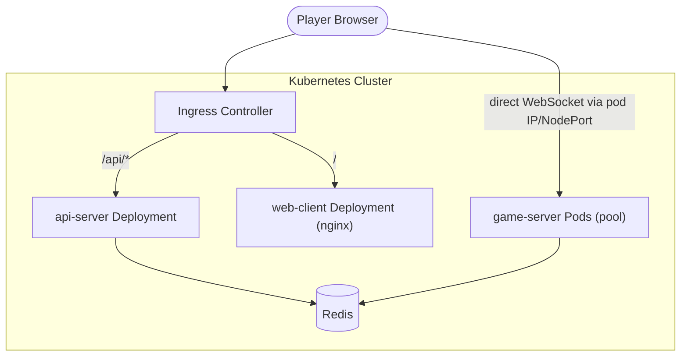
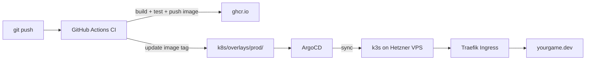

# IO Game -- Kubernetes and CI/CD Focused Plan

## Goal

A playable wings.io-style io game that doubles as a portfolio piece demonstrating Kubernetes operational depth and a production-grade CI/CD pipeline. Microservices are deliberately minimal; the impressive part is how the game is built, deployed, scaled, and observed.

## Locked-In Game Mechanics

- **Movement:** Mouse-driven gravity (current prototype). Mouse distance from center controls acceleration strength, mouse angle controls direction. Drag and terminal velocity apply.
- **Combat:** Hybrid ram + shoot. Ramming uses the existing mass/energy collision model. Shooting adds projectiles (details TBD but does not affect infra).
- **Growth:** Destroying static objects and killing players increases mass (and therefore size/power).
- **Match format:** 5-minute timed matches, 10-20 players per lobby, respawn on death.
- **Scoring (MVP):** 1 point per kill + 1 point per 50 mass at match end. Highest combined score wins. Balancing deferred, but the contract is locked for leaderboard integration.
- **Bots:** Fill empty lobby slots after ~5s wait. Colocated inside game-server process.
- **Future:** Powerups/boost ability. Added later without infra changes.
- **Network model:** Server-authoritative. Full world snapshots broadcast at ~20 Hz. Client sends input (direction vector + actions) every frame. No client-side prediction in MVP.

## Repository Layout

```
multGame/
  client/                # React + Vite frontend
    src/
      App.tsx            # React Router: menu, game, leaderboard pages
      pages/
        MainMenu.tsx     # Name entry, play button, top scores preview
        Game.tsx         # Canvas ref + HUD overlays
        Leaderboard.tsx  # Full leaderboard view
      components/
        HUD.tsx          # Score, mass, match timer
        KillFeed.tsx     # "X killed Y" messages
        DeathScreen.tsx  # Respawn countdown overlay
        Scoreboard.tsx   # End-of-match results
        MiniMap.tsx      # Small overview map
      engine/
        index.ts         # Game loop, wires renderer/network/input
        renderer.ts      # Raw canvas drawing (NOT React)
        network.ts       # WebSocket client (NOT React)
        input.ts         # Mouse/keyboard capture (NOT React)
      store/
        gameStore.ts     # Zustand store bridging engine -> React UI
      main.tsx
    index.html
    vite.config.ts
    package.json
    Dockerfile           # Multi-stage: npm build -> nginx serve
  server/                # Go authoritative game server
    cmd/
      gameserver/main.go # Entry point: HTTP health + WS upgrade + game loop
    internal/
      game/              # Simulation: physics, collisions, world
      lobby/             # Lobby lifecycle, player/bot management
      net/               # WebSocket hub, message encoding
      bot/               # Bot AI (colocated, not a separate service)
      metrics/           # Prometheus metric exports
    go.mod
    Dockerfile           # Multi-stage build
  api/                   # Small Go API: matchmaking + leaderboard
    cmd/api/main.go
    internal/
      matchmaking/       # Find/assign lobby, session registry
      leaderboard/       # Score storage, read APIs
    Dockerfile
  k8s/                   # Kubernetes manifests
    base/                # Kustomize base (all environments share)
    overlays/
      dev/               # Local dev overrides (fewer replicas, debug)
      staging/
      prod/              # Production overrides (HPA, PDB, resources)
    helm/                # Optional Helm chart alternative
  .github/
    workflows/
      ci.yml             # Build, test, lint, scan, push images
      cd.yml             # Deploy via ArgoCD sync or kubectl apply
  docker-compose.yml     # Local dev: all services + Redis
  Makefile               # Common commands: build, test, run-local, deploy
```

## Architecture



Three deployables plus Redis:

- **game-server** -- Go binary. Runs authoritative game loops. One pod can host multiple lobbies. Exposes `/ws` for player connections and `/healthz`, `/readyz`, `/metrics` endpoints.
- **api-server** -- Go binary. Handles matchmaking (assigns players to a game-server pod + lobby) and leaderboard reads/writes. Stateless.
- **web-client** -- nginx container serving the Vite-built React app.
- **Redis** -- Session registry (which lobbies exist on which pods), leaderboard sorted sets, matchmaking queue.

### WebSocket Routing Strategy

Clients must connect to the **specific** game-server pod that owns their lobby. Generic Ingress round-robin would route to the wrong pod.

**How it works:**

1. Client calls `POST /api/matchmaking/join` with player name.
2. API server looks up available lobbies in Redis. Each lobby entry stores the pod's direct address (e.g., `ws://game-server-pod-2.game-server.game-ns.svc.cluster.local:8080/ws?lobby=abc123`).
3. API returns `{ wsUrl: "<direct pod address>", lobbyId: "abc123", token: "<short-lived JWT>" }`.
4. Client opens a WebSocket directly to that URL. The token prevents unauthorized connections.

**In Kubernetes, this requires:**
- A **headless Service** (`clusterIP: None`) for game-server, so each pod gets a stable DNS name (e.g., `game-server-0.game-server.game-ns.svc.cluster.local`).
- Using a **StatefulSet** instead of a Deployment for game-server, giving pods predictable ordinal names.
- For external access (production), each game-server pod gets a dedicated **NodePort** or the Ingress is configured with session-affinity annotations. Alternatively, the API server returns a session token and the Ingress routes `/ws/{token}` to the correct pod using a small routing table in Redis.

**MVP simplification:** In Phase 1 (Docker Compose, single game-server instance), this is trivial -- the API just returns `ws://localhost:8080/ws?lobby=abc123`. The multi-pod routing only matters starting in Phase 2.

## Phase 1: Core Game (Local, No K8s Yet)

Build the playable game first using Docker Compose.

### Game Server (Go)

- Fixed-timestep authoritative loop at 60 Hz (reuse physics constants from existing prototype: WORLD 4000x4000, GRAVITY_ACCEL 2400, DRAG 0.98, TERMINAL_SPEED 900)
- WebSocket endpoint accepting player input: `{angle: float, strength: float, shoot: bool}`
- Full world snapshot broadcast at ~20 Hz: all entity positions, rotations, radii, health, types
- Lobby struct: players (real + bot), projectiles, static collectible objects, match timer (5 min), scores
- Collision: player-vs-object (existing energy model), player-vs-player (ram, larger mass wins), projectile-vs-player (damage reduces mass)
- Respawn: dead players respawn at random position with starting mass after 2s delay
- Graceful shutdown: on SIGTERM, stop accepting new connections, broadcast "server shutting down", wait for match to end or timeout (important for k8s later)

### Client (React + Vite + TypeScript)

React manages all UI; a plain TypeScript game engine module manages the canvas.

**React layer (UI around/over the canvas):**

- `MainMenu` page: name input, region select, "Play" button, top-5 leaderboard preview. Calls `POST /api/matchmaking/join`.
- `Game` page: holds a `<canvas>` ref and mounts HUD overlays on top via absolute positioning.
- `HUD` component: score, mass, match timer countdown. Subscribes to zustand store.
- `KillFeed` component: scrolling "X killed Y" messages.
- `DeathScreen` overlay: "Killed by X", respawn countdown, shown when player is dead.
- `Scoreboard` overlay: end-of-match results with final standings. "Play Again" button.
- `Leaderboard` page: full leaderboard fetched from `GET /api/leaderboard`.
- Zustand store (`gameStore.ts`): holds UI-relevant state (score, health, killFeed, matchTimer, isAlive, matchOver). Updated by the engine, subscribed to by React.

**Engine layer (NOT React, plain TypeScript):**

- `renderer.ts`: raw canvas API calls, drawing all entities from the latest server snapshot. Runs in `requestAnimationFrame`.
- `network.ts`: WebSocket client. Receives world snapshots, buffers last two for interpolation, pushes UI state to zustand store.
- `input.ts`: captures mouse position and clicks, sends `{angle, strength, shoot}` to server every frame.
- `index.ts`: initializes engine with a canvas element, starts the game loop.

**Key pattern:** React calls `useRef` to get the canvas element, passes it to the engine via `useEffect`. The engine runs independently of React renders. Only UI-relevant state crosses the boundary via zustand.

### API Server

- `POST /api/matchmaking/join` -- accepts `{playerName}`, returns `{wsUrl, lobbyId, token}`. The `wsUrl` points directly at the owning game-server pod (see WebSocket Routing Strategy). The `token` is a short-lived JWT for auth on connect.
- `GET /api/leaderboard` -- returns top N scores. Each entry: `{playerName, kills, massBonus, totalScore}`.
- `POST /api/leaderboard/report` -- called by game-server at match end. Payload: `{lobbyId, results: [{playerId, playerName, kills, finalMass}]}`. API server computes `totalScore = kills + floor(finalMass / 50)` and updates Redis sorted set.

### Bots

- Colocated inside game-server process
- Simple state machine: wander, chase nearest small player, flee from larger players
- Matchmaking fills lobbies with bots after a short wait (~5s)

### Local Dev

- `docker-compose up` runs game-server, api-server, web-client, Redis
- `Makefile` with targets: `build`, `test`, `run`, `lint`

## Phase 2: Kubernetes

### Manifests (Kustomize)

- **Base** manifests for each Deployment, Service, ConfigMap
- **Overlays** for dev (1 replica, no resource limits) and prod (HPA, PDB, tight limits)
- Namespace isolation: `game-dev`, `game-staging`, `game-prod`

### Key K8s Features to Demonstrate

1. **Custom Metrics HPA** -- Scale game-server pods based on `active_players_per_pod` (exported via Prometheus). More impressive than CPU-based scaling.
2. **Pod Disruption Budget** -- Ensure at least N game-server pods stay up during rolling updates so active matches aren't killed.
3. **Graceful Shutdown / PreStop Hook** -- Game server handles SIGTERM by draining: stops accepting new players, lets current match finish (up to a deadline), then exits. Set `terminationGracePeriodSeconds` accordingly.
4. **Readiness vs Liveness Probes** -- Readiness: "I have capacity for more players." Liveness: "My game loop is not stuck." This distinction matters for game servers.
5. **Resource Requests/Limits** -- Meaningful for a CPU-bound physics loop. Profile and set appropriate values.
6. **ConfigMaps / Secrets** -- Game tuning parameters (world size, max players, tick rate) as ConfigMaps. Redis credentials as Secrets.
7. **Ingress** with path-based routing for API and web-client. Game-server uses headless Service + StatefulSet for direct pod addressing (see WebSocket Routing Strategy above).

### Minimal Metrics Stack (Required for HPA)

Custom metrics HPA depends on a metrics pipeline. Deploy this in Phase 2 alongside manifests, not in Phase 4:

- **Prometheus** (kube-prometheus-stack Helm chart, minimal config) scraping game-server `/metrics`.
- **Prometheus Adapter** to expose `active_players_per_pod` as a custom metric to the Kubernetes API.
- Game server already exports this metric from Phase 1 (the `/metrics` endpoint).

Phase 4 adds dashboards, alerts, and expanded metrics on top of this base.

### Local K8s

- Use **k3d** (lightweight k3s in Docker) for local cluster
- Skaffold or Tilt for inner-loop dev (auto-rebuild + redeploy on code change)

## Phase 3: CI/CD Pipeline

### CI (GitHub Actions -- `ci.yml`)

Triggers on every push / PR:

1. **Lint** -- `golangci-lint` for Go, ESLint + TypeScript strict for React client
2. **Test** -- `go test ./...` for game logic, Vitest for React components and engine modules, integration tests for WebSocket handshake
3. **Build** -- Multi-stage Docker builds for game-server, api-server, web-client (Vite build + nginx)
4. **Scan** -- Trivy or Grype for container image vulnerabilities
5. **Push** -- Push images to GitHub Container Registry (ghcr.io), tagged with git SHA

### CD (GitOps)

Use **ArgoCD** with **ArgoCD Image Updater**:

- ArgoCD watches the `k8s/` directory in this repo and syncs manifests to the cluster.
- ArgoCD Image Updater watches ghcr.io for new image tags matching a semver or SHA pattern. When a new image is pushed by CI, Image Updater automatically updates the live deployment -- no commit back to the repo needed, avoiding CI/CD trigger loops.
- Kustomize overlays pin image tags for each environment. For prod, Image Updater manages the tag. For dev/staging, tags are updated manually or by CI writing to a separate `env-config` branch.

This avoids the common pitfall where CI commits a tag bump to the repo, which triggers another CI run, which commits another tag bump, etc. Image Updater breaks the loop by operating outside of git.

### Preview Environments (Stretch Goal)

- On PR open: spin up a full namespaced environment (`game-pr-123`)
- Run smoke tests (bot client connects, plays for 10s, asserts no crash)
- On PR close: tear down the namespace
- This is very impressive in a portfolio and not hard with Kustomize + a small script

## Phase 4: Observability (Expand on Phase 2 Metrics Base)

Phase 2 installs a minimal Prometheus + Adapter stack for HPA. Phase 4 expands it into full observability:

- **Grafana** dashboards showing: active players, lobbies, tick rate, WebSocket message rates, match outcomes, pod count, API latency.
- **Expanded Prometheus metrics** from api-server: request latency histograms, matchmaking queue depth, leaderboard read/write rates.
- **Alerting rules**: tick rate dropping below 55 Hz, game-server pod restarts, API error rate > 1%, Redis connection failures.
- **Loki** (optional) for centralized log aggregation from all pods.

## Phase 5: Production Hosting

Deploy the game to a public URL so it can be linked from a resume.

### Infrastructure: Single VPS + k3s

- 1x **Hetzner CX22** (2 vCPU, 4GB RAM, ~$4/month) or equivalent DigitalOcean/Linode droplet
- **k3s** installed as a single-node Kubernetes cluster (certified, conformant Kubernetes)
- k3s comes with Traefik Ingress built in, which handles routing to all three services
- A cheap domain (~$10/year) with DNS A record pointing at the VPS IP
- **cert-manager** in the cluster for automatic Let's Encrypt HTTPS certificates

### Why k3s on a VPS

- k3s is real Kubernetes (passes conformance tests). The same Kustomize manifests from Phase 2 deploy without changes.
- Shows you can provision and manage a cluster, not just use a managed one. More impressive on a resume.
- $4-10/month is sustainable for a portfolio project, unlike managed k8s ($12-75/month for the control plane alone).
- Single-node is fine for this scale. 10-20 players per lobby with a Go server uses minimal resources.

### Provisioning (optional Terraform)

- Optionally use **Terraform** to declaratively provision the Hetzner VPS, DNS records, and firewall rules
- Store Terraform state in a remote backend (Terraform Cloud free tier or an S3-compatible bucket)
- This adds another portfolio-worthy layer: infrastructure-as-code

### Deployment Flow



### Reliability Expectations

This is portfolio-tier hosting, not production SLA. A single-node cluster has no redundancy -- if the VPS reboots or Hetzner has an outage, the game goes down. That's acceptable for a resume link.

**Hardening checklist (small effort, big difference):**
- k3s auto-restarts on boot via systemd (default behavior, just verify).
- Redis data persisted to a local volume (PersistentVolume) so leaderboard survives pod restarts.
- All Kubernetes manifests and Terraform state stored in git -- full rebuild from scratch takes minutes, not hours.
- Simple uptime check (e.g., UptimeRobot free tier) pings the site and alerts you if it goes down.
- Automated daily backup of Redis RDB to an S3-compatible bucket (optional, ~$0.01/month for Backblaze B2).

### Cost Summary

- Hetzner CX22: ~$4/month
- Domain: ~$10/year (~$1/month)
- Total: **~$5/month**

## Phase 6: Stretch Goals (After Core Is Solid)

- **Agones** for pod-per-lobby allocation with warm pool
- **Canary deployments** with Argo Rollouts (route 10% of new connections to new version)
- **Load testing** in CI using synthetic bot clients
- **Multi-region** deployment with region-based matchmaking
- **Managed k8s migration** (move from k3s to GKE/DOKS to demonstrate both approaches)

## Build Order Summary

- **Phase 1** -- Playable game locally via Docker Compose (Dockerfiles, Makefile)
- **Phase 2** -- Deploy to local k3d cluster (Kustomize, probes, HPA, PDB, graceful shutdown)
- **Phase 3** -- CI/CD pipeline (GitHub Actions, image scanning, ArgoCD GitOps)
- **Phase 4** -- Observability (Prometheus, Grafana, custom metrics)
- **Phase 5** -- Production hosting (Hetzner VPS, k3s, domain, HTTPS, optional Terraform)
- **Phase 6** -- Stretch (Agones, canary, load tests, multi-region)
