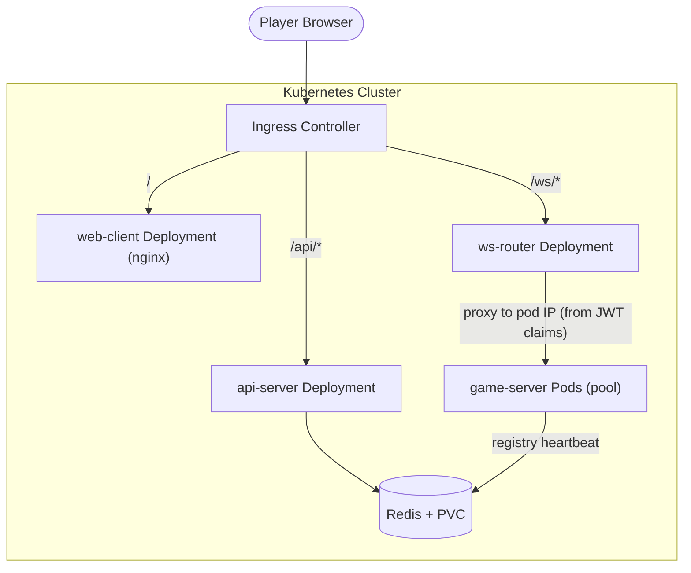
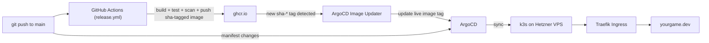

# IO Game -- Kubernetes and CI/CD Focused Plan

## Goal

A playable wings.io-style io game that doubles as a portfolio piece demonstrating Kubernetes operational depth and a production-grade CI/CD pipeline. Microservices are deliberately minimal; the impressive part is how the game is built, deployed, scaled, and observed.

## Locked-In Game Mechanics

- **Movement:** Mouse-driven gravity (current prototype). Mouse distance from center controls acceleration strength, mouse angle controls direction. Drag and terminal velocity apply.
- **Combat:** Hybrid ram + shoot. Ramming uses the existing mass/energy collision model. Shooting adds projectiles (details TBD but does not affect infra).
- **Growth:** Destroying static objects and killing players increases mass (and therefore size/power).
- **Match format:** 5-minute timed matches, 10-20 players per lobby, respawn on death.
- **Scoring (MVP):** 1 point per kill + 1 point per 50 mass at match end. Highest combined score wins. Balancing deferred, but the contract is locked for leaderboard integration.
- **Bots:** Fill empty lobby slots after ~5s wait. Colocated inside game-server process.
- **Future:** Powerups/boost ability. Added later without infra changes.
- **Network model:** Server-authoritative. Full world snapshots broadcast at ~20 Hz. Client sends input (direction vector + actions) every frame. No client-side prediction in MVP.

## Repository Layout

```
multGame/
  client/                # React + Vite frontend
    src/
      App.tsx            # React Router: menu, game, leaderboard pages
      pages/
        MainMenu.tsx     # Name entry, play button, top scores preview
        Game.tsx         # Canvas ref + HUD overlays
        Leaderboard.tsx  # Full leaderboard view
      components/
        HUD.tsx          # Score, mass, match timer
        KillFeed.tsx     # "X killed Y" messages
        DeathScreen.tsx  # Respawn countdown overlay
        Scoreboard.tsx   # End-of-match results
        MiniMap.tsx      # Small overview map
      engine/
        index.ts         # Game loop, wires renderer/network/input
        renderer.ts      # Raw canvas drawing (NOT React)
        network.ts       # WebSocket client (NOT React)
        input.ts         # Mouse/keyboard capture (NOT React)
      store/
        gameStore.ts     # Zustand store bridging engine -> React UI
      main.tsx
    index.html
    vite.config.ts
    package.json
    Dockerfile           # Multi-stage: npm build -> nginx serve
  server/                # Go authoritative game server
    cmd/
      gameserver/main.go # Entry point: HTTP health + WS upgrade + game loop
    internal/
      game/              # Simulation: physics, collisions, world
      lobby/             # Lobby lifecycle, player/bot management
      net/               # WebSocket hub, message encoding
      bot/               # Bot AI (colocated, not a separate service)
      metrics/           # Prometheus metric exports
    go.mod
    Dockerfile           # Multi-stage build
  api/                   # Small Go API: matchmaking + leaderboard
    cmd/api/main.go
    internal/
      matchmaking/       # Find/assign lobby, session registry
      leaderboard/       # Score storage, read APIs
      registry/          # Pod registry cleanup goroutine
    Dockerfile
  ws-router/             # WebSocket routing proxy (Phase 2+)
    cmd/router/main.go   # JWT validation, WS proxy (no Redis at routing time)
    Dockerfile
  k8s/                   # Kubernetes manifests
    base/                # Kustomize base (all environments share)
    overlays/
      dev/               # Local dev overrides (fewer replicas, debug)
      prod/              # Production overrides (HPA, PDB, resources)
    helm/                # Optional Helm chart alternative
  .github/
    workflows/
      ci.yml             # PR-only: lint, test, build, manifest validation
      release.yml        # Push to main: lint, test, build, scan, push images to GHCR
  docker-compose.yml     # Local dev: all services + Redis
  Makefile               # Common commands: build, test, run-local, deploy
```

## Architecture



Four deployables plus Redis:

- **game-server** -- Go binary. Runs authoritative game loops. One pod can host multiple lobbies. Exposes `/ws` for player connections and `/healthz`, `/readyz`, `/metrics` endpoints. Registers itself and its lobbies in Redis (see Pod Registry Lifecycle).
- **api-server** -- Go binary. Handles matchmaking (assigns players to a game-server pod + lobby) and leaderboard reads/writes. Runs background registry cleanup goroutine. Stateless otherwise.
- **ws-router** -- Small Go binary (~150 LOC). Receives WebSocket connections from Ingress at `/ws/{token}`, validates the JWT, reads `pod_ip` + `lobby_id` from claims, and proxies the connection to the owning game-server pod. No Redis dependency — routing is fully derived from the signed JWT. Stateless. (Introduced in Phase 2; not needed in Phase 1 Docker Compose.)
- **web-client** -- nginx container serving the Vite-built React app.
- **Redis** -- Pod registry, lobby ownership, leaderboard sorted sets. Deployed as a single-instance Deployment with PVC (see Redis Deployment section).

### WebSocket Routing Strategy (Locked)

Clients must connect to the **specific** game-server pod that owns their lobby. Generic Ingress round-robin would route to the wrong pod.

**Chosen approach: Token-aware WebSocket router behind Ingress.**

All WebSocket traffic flows through a single Ingress path (`/ws/{token}`). The API server issues a short-lived JWT whose claims carry the target `pod_ip` and `lobby_id` — the token is the sole source of truth for routing. The game-server Deployment sits behind a normal ClusterIP Service. A lightweight **ws-router** standalone Deployment (a small Go binary) receives incoming `/ws/{token}` connections, validates the JWT signature, reads `pod_ip` and `lobby_id` from its claims, and proxies the WebSocket directly to that pod's cluster-internal address. No Redis lookup at routing time.

**Why this approach over direct pod routing:**
- Works identically in k3d and production -- no per-pod NodePorts, no external DNS for individual pods.
- Single Ingress entry point; TLS terminates once.
- Demonstrates a real routing pattern (token -> JWT validation -> proxy) without requiring StatefulSet or headless Service complexity for game-server.
- Easier to reason about firewall rules, load balancer config, and cost.

**How it works:**

1. Client calls `POST /api/matchmaking/join` with player name.
2. API server looks up available lobbies in Redis. Each lobby entry stores the owning pod's cluster-internal IP and port.
3. API returns `{ wsUrl: "wss://<domain>/ws/<token>", lobbyId: "abc123", token: "<short-lived JWT>" }`.
4. Client connects to the single Ingress endpoint. Ingress routes `/ws/*` to the ws-router service.
5. ws-router validates the JWT signature, reads `pod_ip` and `lobby_id` from claims, and proxies the WebSocket connection to `http://<pod-ip>:8080/ws?lobby=abc123`. No Redis call at routing time — the JWT is self-contained.

**ws-router implementation:**
- Small Go binary (~150 LOC): HTTP server, JWT validation, `net/http/httputil.ReverseProxy` with WebSocket support. No Redis dependency — routing is fully derived from JWT claims.
- Deployed as a Deployment (2 replicas for availability) with its own ClusterIP Service.
- Stateless — needs only the JWT signing key (shared via Secret with api-server).

**Phase 1 simplification:** In Docker Compose with a single game-server instance, the ws-router is unnecessary. The API returns `ws://localhost:8080/ws?lobby=abc123&token=<jwt>` directly. The ws-router is introduced in Phase 2.

### Pod Registry Lifecycle (Locked)

The multi-pod setup requires Redis to always know which pod owns which lobby. This is the registry contract:

**Pod registration (on startup):**
- Each game-server pod registers itself in Redis on boot: `HSET pod:registry <pod-ip> '{"ip":"...","port":8080,"state":"ready","lobbies":0}'`.
- Registration includes a TTL-backed heartbeat key: `SET pod:heartbeat:<pod-ip> 1 EX 10`.

**Heartbeat (every 5s):**
- Each pod refreshes its heartbeat key: `SET pod:heartbeat:<pod-ip> 1 EX 10`.
- If a pod crashes without cleanup, the heartbeat key expires in 10s.

**Lobby ownership:**
- When a pod creates a lobby: `HSET lobby:<lobby-id> pod_ip <pod-ip>` with a TTL matching the max match duration + buffer (330s).
- The matchmaking API reads `HGET lobby:<lobby-id> pod_ip` to resolve the owning pod for a join request.

**Drain state (on SIGTERM / scale-down):**
- Pod sets its registry state to `"draining"`: `HSET pod:registry <pod-ip> '{"state":"draining",...}'`.
- Matchmaking API skips pods in `"draining"` state when assigning new players.
- Pod continues serving existing matches until they finish or the termination deadline hits.

**Cleanup (on shutdown or crash):**
- **Graceful:** Pod deletes its registry entry and all its lobby keys on clean exit.
- **Crash:** A background goroutine in the API server (or a Kubernetes CronJob) scans `pod:registry` entries whose `pod:heartbeat:<ip>` key has expired. It removes the stale registry entry and any lobby keys pointing at the dead pod. Scan interval: 15s.

**Consistency guarantee:** Stale `wsUrl` values are bounded by the heartbeat TTL (10s) + scan interval (15s) = 25s worst case.

**Failure contract for stale routing:** If ws-router cannot dial the backend pod (connection refused, timeout after 3s), it responds with **HTTP 502** before the WebSocket upgrade completes. If the backend pod dies after the WebSocket is established, ws-router closes the client connection with **WebSocket close code 4001** and reason `"pod_unavailable"`. The client treats both cases identically: display a brief "reconnecting..." message, then call `POST /api/matchmaking/join` to get a fresh token and reconnect. The client does not attempt blind reconnection to the same `wsUrl`.

## Phase 1: Core Game (Local, No K8s Yet)

Build the playable game first using Docker Compose.

### Game Server (Go)

- Fixed-timestep authoritative loop at 60 Hz (reuse physics constants from existing prototype: WORLD 4000x4000, GRAVITY_ACCEL 2400, DRAG 0.98, TERMINAL_SPEED 900)
- WebSocket endpoint accepting player input: `{angle: float, strength: float, shoot: bool}`
- Full world snapshot broadcast at ~20 Hz: all entity positions, rotations, radii, health, types
- Lobby struct: players (real + bot), projectiles, static collectible objects, match timer (5 min), scores
- Collision: player-vs-object (existing energy model), player-vs-player (ram, larger mass wins), projectile-vs-player (damage reduces mass)
- Respawn: dead players respawn at random position with starting mass after 2s delay
- Graceful shutdown: on SIGTERM, stop accepting new connections, broadcast "server shutting down", wait for match to end or timeout (important for k8s later)

### Client (React + Vite + TypeScript)

React manages all UI; a plain TypeScript game engine module manages the canvas.

**React layer (UI around/over the canvas):**

- `MainMenu` page: name input, region select, "Play" button, top-5 leaderboard preview. Calls `POST /api/matchmaking/join`.
- `Game` page: holds a `<canvas>` ref and mounts HUD overlays on top via absolute positioning.
- `HUD` component: score, mass, match timer countdown. Subscribes to zustand store.
- `KillFeed` component: scrolling "X killed Y" messages.
- `DeathScreen` overlay: "Killed by X", respawn countdown, shown when player is dead.
- `Scoreboard` overlay: end-of-match results with final standings. "Play Again" button.
- `Leaderboard` page: full leaderboard fetched from `GET /api/leaderboard`.
- Zustand store (`gameStore.ts`): holds UI-relevant state (score, health, killFeed, matchTimer, isAlive, matchOver). Updated by the engine, subscribed to by React.

**Engine layer (NOT React, plain TypeScript):**

- `renderer.ts`: raw canvas API calls, drawing all entities from the latest server snapshot. Runs in `requestAnimationFrame`.
- `network.ts`: WebSocket client. Receives world snapshots, buffers last two for interpolation, pushes UI state to zustand store.
- `input.ts`: captures mouse position and clicks, sends `{angle, strength, shoot}` to server every frame.
- `index.ts`: initializes engine with a canvas element, starts the game loop.

**Key pattern:** React calls `useRef` to get the canvas element, passes it to the engine via `useEffect`. The engine runs independently of React renders. Only UI-relevant state crosses the boundary via zustand.

### API Server

- `POST /api/matchmaking/join` -- accepts `{playerName}`, returns `{wsUrl, lobbyId, token}`. In Phase 1 (single instance), `wsUrl` points directly at the game-server. In Phase 2+, `wsUrl` is `wss://<domain>/ws/<token>` — the client connects to the Ingress and ws-router resolves the target pod from JWT claims (see WebSocket Routing Strategy). The `token` is a short-lived JWT carrying `pod_ip` and `lobby_id`.
- `GET /api/leaderboard` -- returns top N scores. Each entry: `{playerName, kills, massBonus, totalScore}`.
- `POST /api/leaderboard/report` -- called by game-server at match end. Payload: `{lobbyId, results: [{playerId, playerName, kills, finalMass}]}`. API server computes `totalScore = kills + floor(finalMass / 50)` and updates Redis sorted set.

### Bots

- Colocated inside game-server process
- Simple state machine: wander, chase nearest small player, flee from larger players
- Matchmaking fills lobbies with bots after a short wait (~5s)

### Local Dev

- `docker-compose up` runs game-server, api-server, web-client, Redis
- `Makefile` with targets: `build`, `test`, `run`, `lint`

## Phase 2: Kubernetes

### Manifests (Kustomize)

- **Base** manifests for each Deployment/Service/ConfigMap: game-server, api-server, web-client, ws-router, Redis (see below)
- **Overlays** for dev (1 replica, no resource limits, k3d-compatible) and prod (HPA, PDB, tight resource limits)
- Namespace isolation: `game-dev`, `game-prod` (staging deferred until CI/CD lands in Phase 3; adding it earlier would be an untested overlay with no pipeline to exercise it)

### Key K8s Features to Demonstrate

1. **Custom Metrics HPA** -- Scale game-server pods based on `active_players_per_pod` (exported via Prometheus). More impressive than CPU-based scaling.
2. **Pod Disruption Budget** -- Ensure at least N game-server pods stay up during rolling updates so active matches aren't killed. `minAvailable: 1` for dev, `minAvailable: 2` for prod.
3. **Graceful Shutdown / PreStop Hook** -- Concrete policy:
   - On SIGTERM, the game-server sets its pod registry state to `"draining"` (see Pod Registry Lifecycle) and stops accepting new WebSocket connections.
   - Active matches continue running until they finish naturally (max 300s = 5 min match) or are force-terminated.
   - **`terminationGracePeriodSeconds: 330`** (300s match + 30s buffer for final score reporting and cleanup).
   - If a match is still running when the 330s deadline hits, the server broadcasts a "server shutting down" message and exits. Clients see a disconnect, not a hang.
   - **Rolling update interaction:** `maxUnavailable: 0`, `maxSurge: 1`. New pods come up and become ready before old pods receive SIGTERM. Combined with PDB, this ensures zero active-match disruption during deploys.
   - **HPA scale-down interaction:** HPA targets game-server pods. When scaling down, Kubernetes picks a pod to terminate and sends SIGTERM. The 330s grace period means scale-down is slow but safe — the pod drains its matches before exiting. The HPA controller itself cannot call application-level drain endpoints; if faster drain is needed in the future, that requires a custom controller or operator (Phase 6 stretch goal). For MVP, SIGTERM + long grace period is sufficient.
4. **Readiness vs Liveness Probes** -- This distinction matters for game servers:
   - **Readiness (`/readyz`):** Returns 200 when the pod has capacity for more players AND is not in drain state. Returns 503 when full or draining. The primary effect is on **matchmaking**: the API server checks Redis registry state (`"ready"` vs `"draining"`/`"full"`) when assigning players, so an unready pod stops receiving new lobby assignments. Kubernetes endpoint removal is a secondary benefit — it prevents the pod from receiving traffic through the game-server ClusterIP Service, but ws-router does not use that Service (it dials pod IPs from JWT claims). Readiness matters most as an input signal to the registry state machine.
   - **Liveness (`/healthz`):** Returns 200 when the game loop is healthy. **Implementation contract:** the game-server main loop writes a `lastTickAt` timestamp (monotonic clock) on every simulation tick. The `/healthz` handler checks `time.Since(lastTickAt) < 2s`. If the loop is stuck (deadlock, infinite loop, GC pause), the tick age exceeds the threshold and liveness fails, triggering a pod restart. This is distinct from "HTTP server is alive" -- a hung game loop with a responsive HTTP listener will still fail liveness.
   - **Probe config:** `initialDelaySeconds: 5`, `periodSeconds: 5`, `failureThreshold: 3` (liveness), `failureThreshold: 1` (readiness).
5. **Resource Requests/Limits** -- Meaningful for a CPU-bound physics loop. Profile and set appropriate values.
6. **ConfigMaps / Secrets** -- Game tuning parameters (world size, max players, tick rate) as ConfigMaps. Redis credentials as Secrets.
7. **Ingress** with path-based routing: `/api/*` -> api-server, `/ws/*` -> ws-router, `/` -> web-client (see WebSocket Routing Strategy above). Game-server pods are not directly exposed via Ingress.

### Redis Deployment (Phase 2 Deliverable)

Redis is required infrastructure in Phase 2 -- matchmaking, lobby registry (pod heartbeats + lobby ownership), and leaderboard all depend on it. ws-router does not use Redis (routing is JWT-based). It is not implied; it ships as part of the Phase 2 manifests.

**Deployment model:** Single-instance Redis deployed as a **Deployment** (1 replica) with a **PersistentVolumeClaim** for AOF/RDB persistence. Not a StatefulSet -- at this scale a single Redis with a PVC is sufficient and simpler.

- **Dev overlay (k3d):** `hostPath` PV or k3d's built-in local-path provisioner. No resource limits.
- **Prod overlay (k3s on VPS):** `local-path` PV backed by host disk. Resource requests: 64Mi memory, 50m CPU. Limits: 128Mi memory, 200m CPU.
- **No Redis Sentinel/Cluster** in MVP. Single-node Redis is a SPOF, which is acceptable for a portfolio project (documented in Phase 5 "Reliability Expectations").

**Manifests to create:**
- `k8s/base/redis/deployment.yaml` -- Redis 7.4-alpine, port 6379, liveness probe (`redis-cli ping`), volume mount for `/data`.
- `k8s/base/redis/service.yaml` -- ClusterIP Service on port 6379.
- `k8s/base/redis/pvc.yaml` -- 1Gi PVC for persistence.
- `k8s/base/redis/configmap.yaml` -- Redis config: `appendonly yes`, `maxmemory 100mb`, `maxmemory-policy allkeys-lru`.

**k3d parity:** The same manifests work in k3d and prod. The only overlay difference is the PV provisioner and resource limits.

### Minimal Metrics Stack (Required for HPA)

Custom metrics HPA depends on a metrics pipeline. Deploy this in Phase 2 alongside manifests, not in Phase 4:

- **Prometheus** (kube-prometheus-stack Helm chart, minimal config) scraping game-server `/metrics`.
- **Prometheus Adapter** to expose `active_players_per_pod` as a custom metric to the Kubernetes API.
- Game server already exports this metric from Phase 1 (the `/metrics` endpoint).

Phase 4 adds dashboards, alerts, and expanded metrics on top of this base.

### Local K8s

- Use **k3d** (lightweight k3s in Docker) for local cluster
- Skaffold or Tilt for inner-loop dev (auto-rebuild + redeploy on code change)

## Phase 3: CI/CD Pipeline

### Prerequisites (Phase 3 starts here)

Phase 3 begins by adding the tooling that CI will exercise. These are Phase 3 deliverables, not assumptions:

- **Go:** Add `golangci-lint` config (`.golangci.yml`) for server, api, and ws-router.
- **TypeScript:** Add ESLint config (`eslint.config.js`) with TypeScript strict rules. Add Vitest with at least smoke-level tests for engine modules and React components.
- **Integration:** Add a WebSocket handshake integration test (Go test that starts the game-server, connects a WS client, asserts a welcome message).
- **Kustomize validation:** Already exercisable via `make k8s-dev` / `make k8s-prod`, but CI will formalize it.

Only after this tooling exists do the CI workflows wrap around it.

### CI Workflow Split (GitHub Actions)

Two workflows, not one. CI never commits back to the repo.

**`ci.yml` -- runs on `pull_request` (all branches):**

1. **Lint** -- `golangci-lint run` for Go modules, `npm run lint` for client.
2. **Test** -- `go test ./...` for server/api/ws-router, `npm run test` (Vitest) for client.
3. **Build** -- Multi-stage Docker builds for game-server, api-server, ws-router, web-client. Build must succeed but images are not pushed.
4. **Manifest validation** -- `kubectl kustomize k8s/overlays/dev`, `kubectl kustomize k8s/overlays/prod`, and `kubectl kustomize k8s/overlays/dev-monitoring`. Fails the PR if any overlay fails to render. Optionally run `kubeconform` for schema validation against the target Kubernetes version.

PRs do **not** push images, scan, or touch any registry. This keeps PR CI fast and safe for forks.

**`release.yml` -- runs on `push` to `main`:**

1. All steps from `ci.yml` (lint, test, build, validate manifests).
2. **Scan** -- Trivy scan on each built image. **Failure policy:** CRITICAL findings block the workflow and prevent image push. HIGH findings are reported as workflow annotations but do not block. Unfixed base-image CVEs (e.g., alpine noise) can be suppressed via a `.trivyignore` allowlist checked into the repo.
3. **Push** -- Push images to GitHub Container Registry (ghcr.io), tagged `sha-<git-sha>`. No `latest` tag is pushed to GHCR; `latest` is only used locally in docker-compose / k3d via `load-images-dev`.

**Optional `workflow_dispatch`:** Manual trigger for force-rebuild or force-redeploy helpers (e.g., rebuild all images from a specific SHA, or trigger an ArgoCD sync via CLI).

### Tagging Strategy

- Every image pushed to GHCR gets an immutable tag: `sha-<full-git-sha>` (e.g., `sha-a1b2c3d4e5f6`).
- No mutable tags (`latest`, `stable`) in the registry. Immutable tags prevent accidental rollbacks and make audit trivial.
- Prod consumes SHA tags exclusively. ArgoCD Image Updater matches `sha-*` pattern.
- Dev/local uses `latest` only via local Docker builds + k3d import (`make load-images-dev`), never from GHCR.

### Registry Auth and Permissions

- `release.yml` needs `packages: write` permission on the GitHub Actions token to push to ghcr.io.
- ArgoCD Image Updater needs GHCR read credentials (a PAT or GitHub App token with `read:packages` scope), configured as a Kubernetes Secret in the ArgoCD namespace.
- If the repo is private, GHCR images are also private by default. ArgoCD Image Updater and the cluster's container runtime both need pull credentials (imagePullSecrets).

### CD (GitOps)

Use **ArgoCD** with **ArgoCD Image Updater**:

- ArgoCD watches the `k8s/` directory in this repo and syncs manifests to the cluster.
- ArgoCD Image Updater watches ghcr.io for new image tags matching the `sha-*` pattern. When a new image is pushed by CI, Image Updater automatically updates the live deployment -- no git commit, no CI trigger loop.
- **CI does not update Kustomize overlays or commit tag bumps.** The entire image-tag lifecycle is owned by Image Updater, operating outside of git. Kustomize overlays define the base configuration; Image Updater overrides the image tag at deploy time.
- For dev, tags are applied manually via `make load-images-dev` (local k3d) or by pointing ArgoCD Image Updater at the same GHCR repo with a dev-specific annotation.

This avoids the common pitfall where CI commits a tag bump to the repo, which triggers another CI run, which commits another tag bump, etc. Image Updater breaks the loop by operating outside of git.

### Preview Environments (Stretch Goal -- Second Pass)

Preview environments are deferred until the main CI/CD path is proven and stable. They depend on:

- Branch-safe image publication (images tagged with PR number or branch name, not just main SHA).
- Namespace-scoped secrets (each preview namespace needs its own app-secrets/redis-secrets).
- Dynamic Ingress hostnames (e.g., `pr-123.multgame.localtest.me`).
- Reliable teardown (namespace deletion on PR close, including PVCs and any leaked resources).

Once the main pipeline is running:

- On PR open: spin up a full namespaced environment (`game-pr-123`).
- Run smoke tests (bot client connects, plays for 10s, asserts no crash).
- On PR close: tear down the namespace.

This is impressive in a portfolio but requires the above prerequisites to work cleanly.

## Phase 4: Observability (Expand on Phase 2 Metrics Base)

Phase 2 installs a minimal Prometheus + Adapter stack for HPA. Phase 4 expands it into full observability:

- **Grafana** dashboards showing: active players, lobbies, tick rate, WebSocket message rates, match outcomes, pod count, API latency.
- **Expanded Prometheus metrics** from api-server: request latency histograms, matchmaking queue depth, leaderboard read/write rates.
- **Alerting rules**: tick rate dropping below 55 Hz, game-server pod restarts, API error rate > 1%, Redis connection failures.
- **Loki** (optional) for centralized log aggregation from all pods.

## Phase 5: Production Hosting

Deploy the game to a public URL so it can be linked from a resume.

### Infrastructure: Single VPS + k3s

- 1x **Hetzner CX22** (2 vCPU, 4GB RAM, ~$4/month) or equivalent DigitalOcean/Linode droplet
- **k3s** installed as a single-node Kubernetes cluster (certified, conformant Kubernetes)
- k3s comes with Traefik Ingress built in, which handles routing to all three services
- A cheap domain (~$10/year) with DNS A record pointing at the VPS IP
- **cert-manager** in the cluster for automatic Let's Encrypt HTTPS certificates

### Why k3s on a VPS

- k3s is real Kubernetes (passes conformance tests). The same Kustomize manifests from Phase 2 deploy without changes.
- Shows you can provision and manage a cluster, not just use a managed one. More impressive on a resume.
- $4-10/month is sustainable for a portfolio project, unlike managed k8s ($12-75/month for the control plane alone).
- Single-node is fine for this scale. 10-20 players per lobby with a Go server uses minimal resources.

### Provisioning (optional Terraform)

- Optionally use **Terraform** to declaratively provision the Hetzner VPS, DNS records, and firewall rules
- Store Terraform state in a remote backend (Terraform Cloud free tier or an S3-compatible bucket)
- This adds another portfolio-worthy layer: infrastructure-as-code

### Deployment Flow



CI only builds, scans, and pushes images. It never commits tag bumps back to the repo. ArgoCD Image Updater detects new tags in GHCR and updates the running deployment directly. ArgoCD separately watches the repo for manifest/config changes.

### Reliability Expectations

This is portfolio-tier hosting, not production SLA. A single-node cluster has no redundancy -- if the VPS reboots or Hetzner has an outage, the game goes down. That's acceptable for a resume link.

**Hardening checklist (small effort, big difference):**
- k3s auto-restarts on boot via systemd (default behavior, just verify).
- Redis data persisted to a local volume (PersistentVolume) so leaderboard survives pod restarts.
- All Kubernetes manifests and Terraform state stored in git -- full rebuild from scratch takes minutes, not hours.
- Simple uptime check (e.g., UptimeRobot free tier) pings the site and alerts you if it goes down.
- Automated daily backup of Redis RDB to an S3-compatible bucket (optional, ~$0.01/month for Backblaze B2).

### Cost Summary

- Hetzner CX22: ~$4/month
- Domain: ~$10/year (~$1/month)
- Total: **~$5/month**

## Phase 6: Stretch Goals (After Core Is Solid)

- **Agones** for pod-per-lobby allocation with warm pool
- **Canary deployments** with Argo Rollouts (route 10% of new connections to new version)
- **Load testing** in CI using synthetic bot clients
- **Multi-region** deployment with region-based matchmaking
- **Managed k8s migration** (move from k3s to GKE/DOKS to demonstrate both approaches)

## Build Order Summary

- **Phase 1** -- Playable game locally via Docker Compose (Dockerfiles, Makefile)
- **Phase 2** -- Deploy to local k3d cluster (Kustomize, probes, HPA, PDB, graceful shutdown)
- **Phase 3** -- CI/CD pipeline (GitHub Actions, image scanning, ArgoCD GitOps)
- **Phase 4** -- Observability (Prometheus, Grafana, custom metrics)
- **Phase 5** -- Production hosting (Hetzner VPS, k3s, domain, HTTPS, optional Terraform)
- **Phase 6** -- Stretch (Agones, canary, load tests, multi-region)
