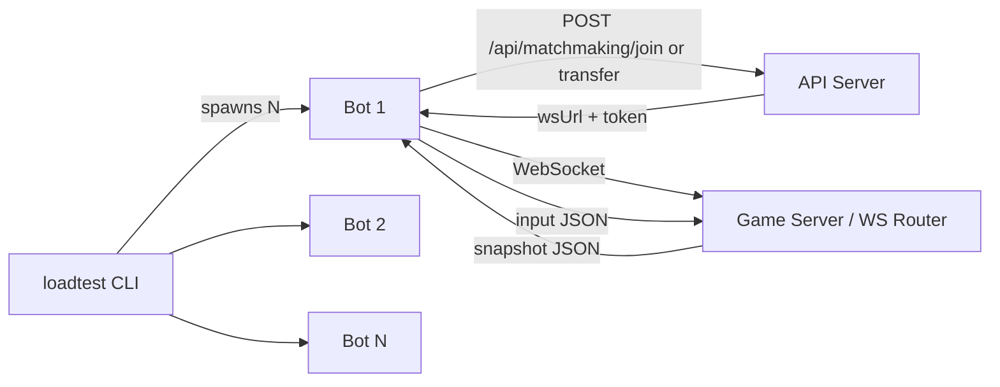

# WebSocket Load-Test Bots Plan

## Purpose

Build a lightweight Node.js load-test harness that simulates many headless websocket clients without opening a browser UI.

This harness is primarily for:

- server-side load validation
- rolling deploy and graceful drain validation
- reconnect and handoff protocol validation at scale
- catching race conditions around transfer placement and reservations

It supports the behavior described in `GRACEFUL_DRAIN_AND_GAMEMODE_TRANSFER_PLAN.md`, but it is a separate tooling plan because it is reusable beyond graceful drain work.

## What This Harness Is

- A standalone Node script/process that spawns many fake players.
- Each fake player calls matchmaking APIs, opens a websocket, consumes snapshots, and sends inputs.
- It exercises the backend protocol at volume without rendering the game in a browser.

## What This Harness Is Not

The Node harness should not be treated as the source of truth for browser behavior.

Unless it fully reimplements the real browser client, it is likely to miss:

- event-ordering quirks in browser websocket handling
- regressions in `client/src/engine/network.ts`
- React/UI behavior during intermission and handoff flows
- future browser-side auth/account persistence behavior

Because of that, this harness should be paired with:

- focused client integration tests for reconnect/handoff logic
- a very small number of browser smoke tests for end-to-end UI wiring

## Recommendation

Use a layered validation strategy:

- **Node load harness:** validates backend behavior under concurrency and rolling-update pressure.
- **Client integration tests:** validate the real reconnect state machine in `client/src/engine/network.ts`.
- **Optional browser e2e test:** validates the full browser app behavior around intermission UI, notices, and handoff-triggered rerouting.

## Harness Architecture

Each bot is a self-contained async loop:

1. join or transfer via HTTP
2. connect websocket
3. read snapshots
4. compute/send input
5. react to reconnect/handoff signals

## Planned Files

- `loadtest/bot-ai.ts`: TypeScript port of game bot decision logic.
- `loadtest/bot-client.ts`: websocket client lifecycle, snapshot parsing, input loop, reconnect, and handoff behavior.
- `loadtest/cli.ts`: spawns N bots, collects stats, handles shutdown.
- `loadtest/package.json`: standalone deps (`ws`, `tsx`) and scripts.

## Bot AI Scope

Port enough server bot behavior for realistic movement/combat pressure:

- nearest-target selection
- collectible scoring/selection
- combat/fire heuristic
- wander retarget timer

Intentional simplifications for snapshot-driven testing:

- skip crash-pair cooldown checks if unavailable in snapshots
- skip invulnerability checks if unavailable in snapshots
- hardcode known health/config defaults where needed

## Bot Client Lifecycle

1. Call `/api/matchmaking/join`.
2. Parse `{ wsUrl, lobbyId, token }`.
3. Connect websocket.
4. On snapshot, compute/send input at a capped rate.
5. On `handoff_notice`, cache handoff metadata and ticket.
6. On close:
   - generic close/error -> retry same route when appropriate
   - explicit handoff close -> call `/api/matchmaking/transfer`
7. On CLI stop signal, close all sockets and print summary.

## Stats and Reporting

Print periodic summary, for example every 2 seconds:

`[12s] bots: 8/10 connected | snapshots: 242/s | inputs: 160/s | handoffs: 3/3 | errors: 0`

At exit, print totals such as:

- duration
- snapshots processed
- reconnect attempts
- transfers attempted/completed
- failures

## Scenarios To Validate

Use the harness to validate:

- rolling deploy with active matches -> no mid-match migration
- intermission deploy drain -> same-mode transfer by default
- explicit player mode-switch during drain -> requested mode honored
- reservation pressure -> retries behave correctly
- generic socket error (non-handoff) -> same-route reconnect first
- reconnect and transfer success rates remain stable during rolling updates

## Suggested Implementation Order

1. Define a minimal bot client that can join, connect, receive snapshots, and send inputs.
2. Port enough bot AI to create realistic gameplay pressure.
3. Add stats collection and CLI orchestration.
4. Add reconnect behavior for generic socket failures.
5. Add `handoff_notice` and transfer-flow support.
6. Add rolling deploy and drain-focused scenarios.
7. Add assertions/reporting for transfer success, reservation failures, and reconnect outcomes.

